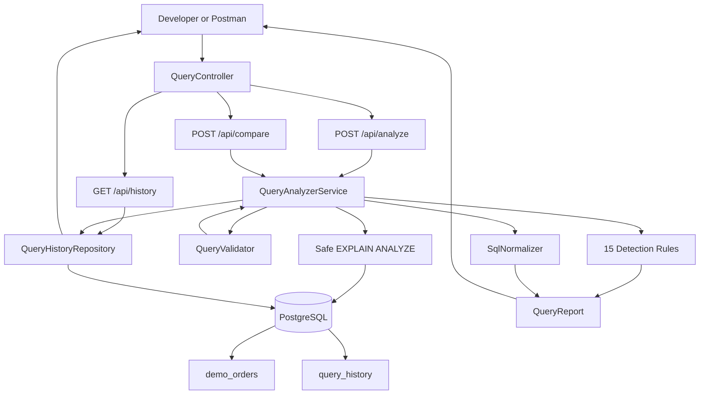
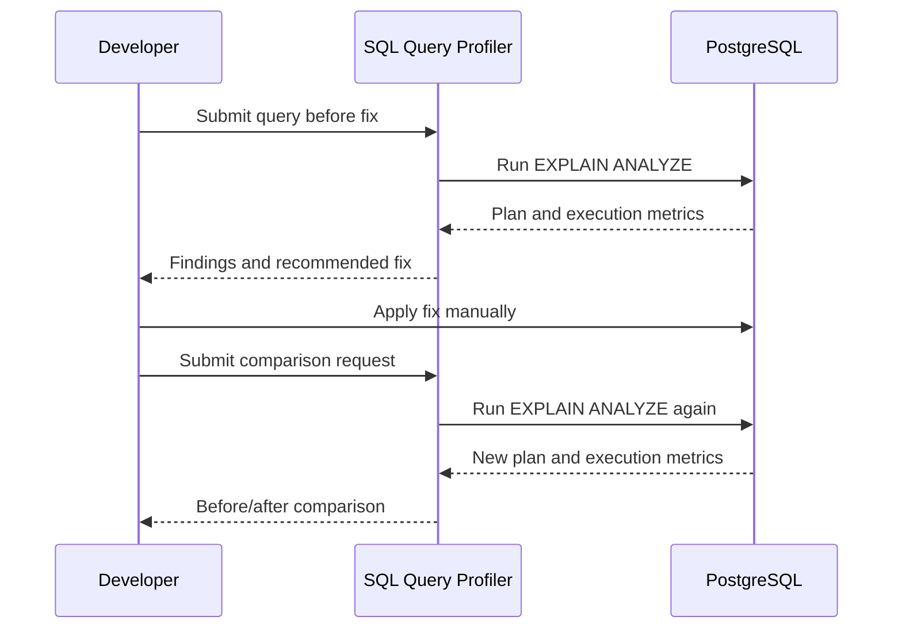
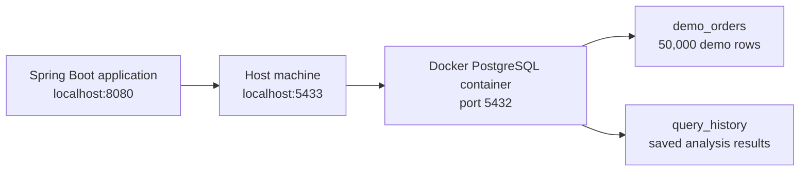
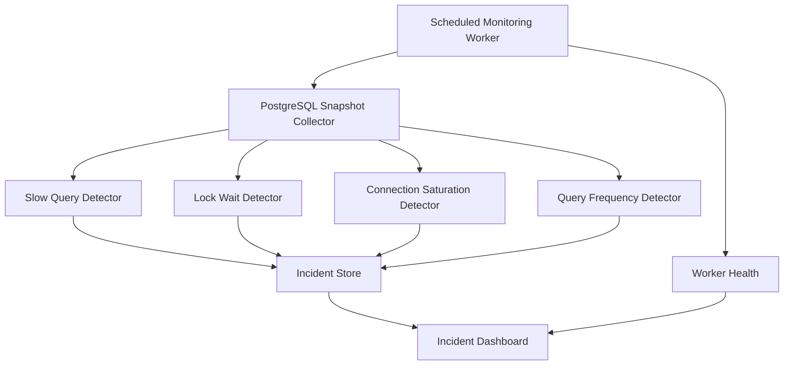

# Architecture

## Stage 1A Architecture

## Before-and-After Comparison

## Database Environment

## Current Responsibilities

| Component | Responsibility |
|---|---|
| `QueryController` | Receives HTTP requests and returns responses |
| `QueryAnalyzerService` | Coordinates validation, analysis, rules, normalization, and history |
| `QueryValidator` | Rejects unsafe or invalid input before database execution |
| Safe EXPLAIN flow | Collects query plans and execution metrics |
| Detection rules | Identify possible SQL performance problems |
| `SqlNormalizer` | Groups similar SQL queries into one structural pattern |
| `QueryHistoryRepository` | Saves and retrieves analysis history |
| PostgreSQL | Stores demo data and profiler history |
| Docker Compose | Provides a reproducible PostgreSQL environment |

## Future Stage 1B Architecture

The monitoring architecture will be added later:

The Stage 1B components shown above are planned and are not part of the current Stage 1A implementation.